# Creating a Static Website Host: Manual vs. Automated (with Terraform)

Understanding the manual setup of a static website host is an essential first step before automating the entire process, especially if you're new to the cloud space. Just like how you learn basic math before using a calculator, getting hands-on experience by clicking through the cloud resources helps you comprehend how everything is connected. In this blog post, we'll explore the manual setup process (using ClickOps) and the automated approach with Terraform for creating a static website host.

### Architectural Diagram
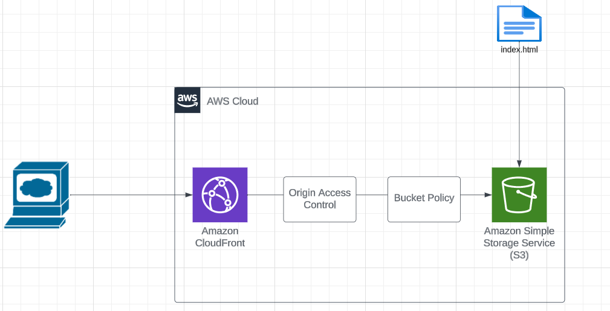

## Resources
To create a static website host, we'll work with the following AWS resources:

- **S3 (Simple Storage Service):** S3 serves as our storage and content delivery solution.
- **CloudFront Distribution:** We'll use CloudFront to distribute our website content efficiently.
- **Origin Access Controls:** These controls help secure our resources and protect our content.

## Manual Setup (ClickOps)
In the manual setup, we'll navigate through the AWS Management Console to create an S3 bucket, configure static website hosting, and set up a CloudFront distribution. This hands-on approach provides valuable insights into how these components are interconnected.

### Step 1
1. Log in to your AWS Account.  
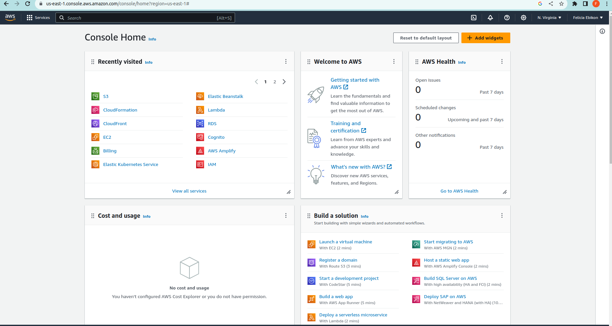 
2. Search for S3, then click into S3
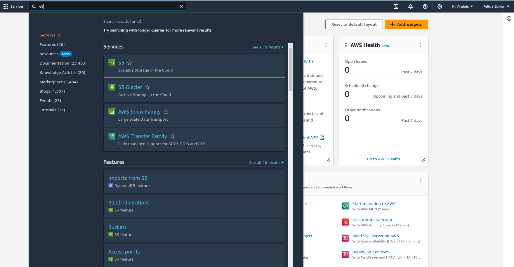

S3 is like a super secure digital storage space in the cloud, where you can store and retrieve your files (like documents, pictures, or videos) whenever you need them. It's always available, and you only pay for what you use.

The image below shows some buckets, if your account is new you should not have any buckets listed
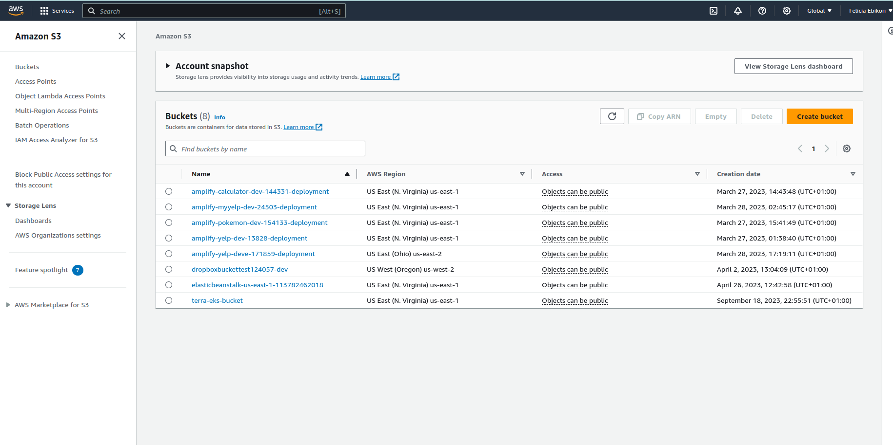

3. Go ahead and hit the orange button
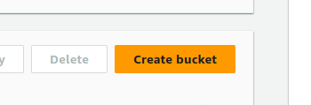

4. Enter your bucket name
When naming our buckets in AWS S3, it's important to know they have a global presence. This means that bucket names are like domain names, and the naming rules for domain names also apply to bucket names. Also, each bucket name must be unique worldwide, so you can name it as you wish, as long as it's not already taken.

5. Choose your prefered region, I'm going to choose us-east-1

6. Leave Object Ownership disabled

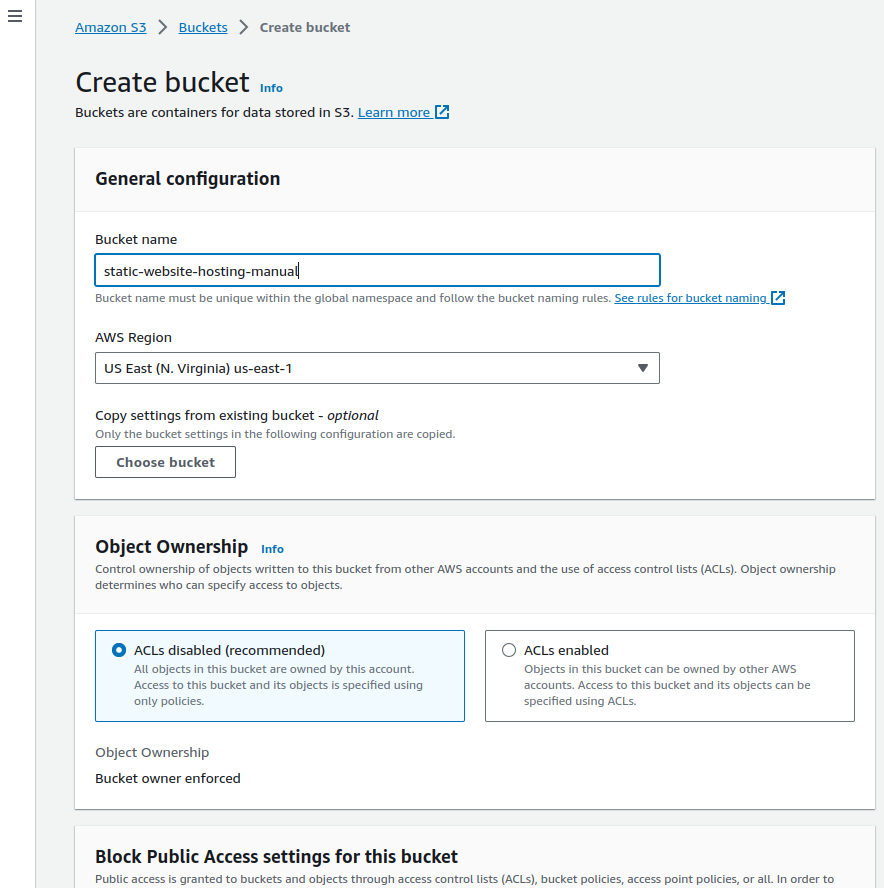

7. Scroll on down, Keep that checkmark that says **`Block all public access`**

8. Keep bucket versioning **`Disabled`**
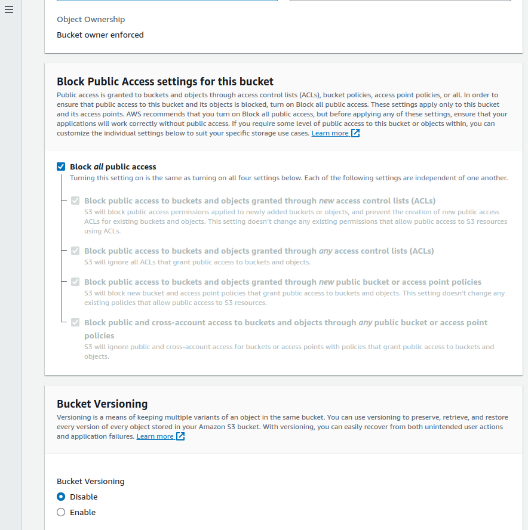

9. Scroll down, For **Encryption Type** Leave it on **`Server-side encryption with Amazon S3 managed keys (SSE-S3)`**

10. Keep `bucket key` **enabled**
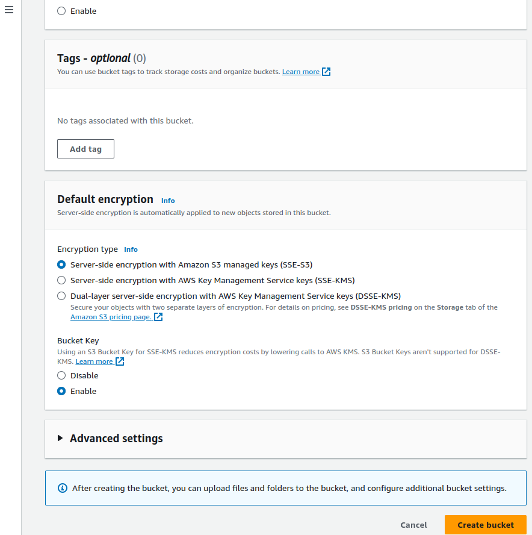

11. In Advanced settings Keep **`Object lock`** **`Disabled`**
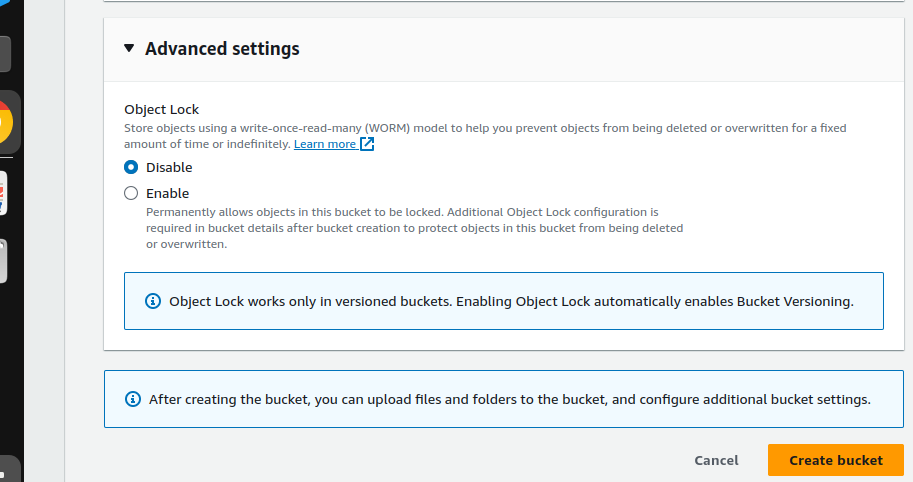

12. Go ahead and create the bucket by clicking on the `create bucket` orange button
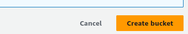

13. If the bucket is created successfully the green message should appear
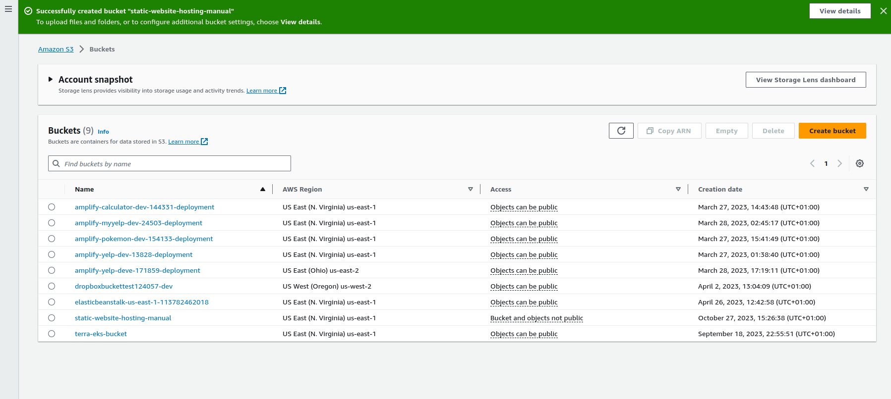

14. Check if the bucket is listed
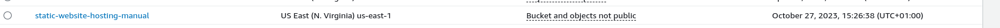


### Step 2
We need to upload some html code to our S3 bucket.

1. Copy the code below or use your own html code
```html
<!DOCTYPE html>
<html>
<head>
    <title>Pizza Preparation List</title>
    <style>
        body {
            font-family: Arial, sans-serif;
        }
        h1 {
            text-align: center;
        }
        ul {
            list-style-type: disc;
            margin-left: 20px;
        }
        li {
            font-size: 18px;
        }
    </style>
</head>
<body>
    <h1>Pizza Preparation List</h1>
    <ul>
        <li>Prepare pizza dough</li>
        <li>Add tomato sauce and cheese</li>
        <li>Add your favorite toppings</li>
        <li>Bake in the oven</li>
        <li>Slice and serve</li>
    </ul>
</body>
</html>

```
Save it in your system, You can open notepad or IDE and paste the html code, save it as index.html

2. Go back to S3, click open the bucket name
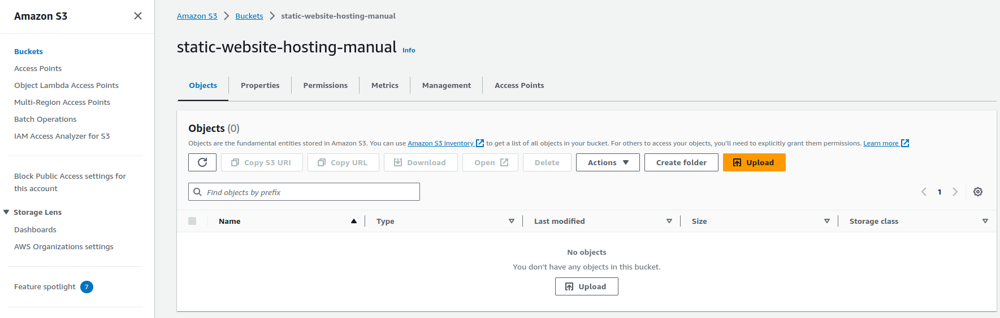

3. Click on the orange upload button
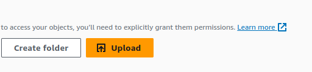

You should see a page similar to this
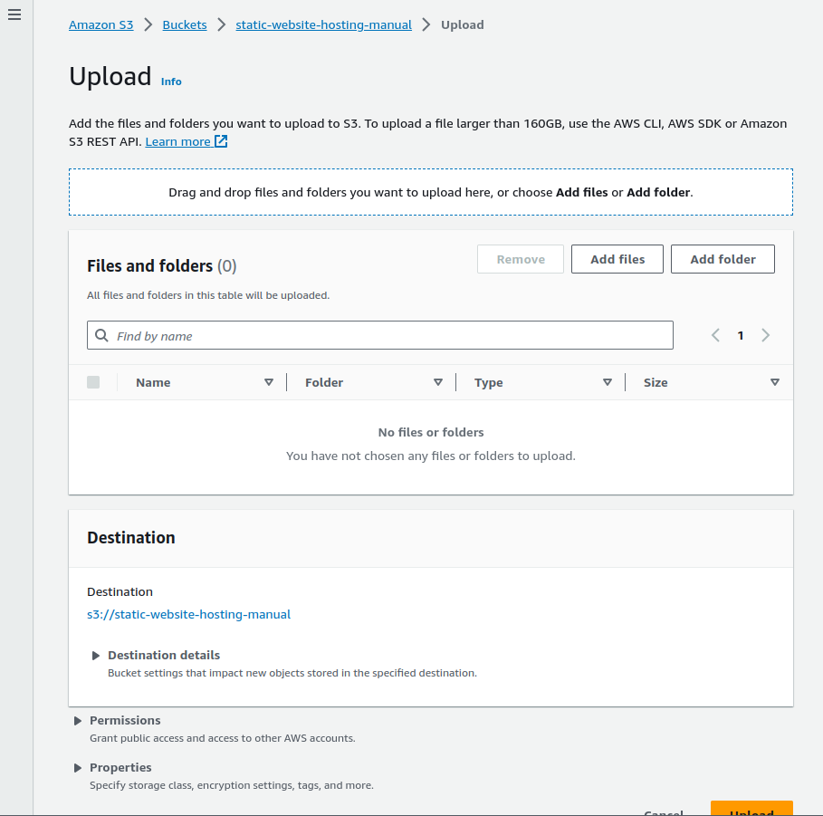

4. Click on `Add files`
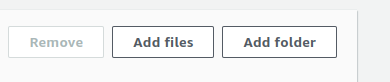

- Select your index.html file from where you saved it
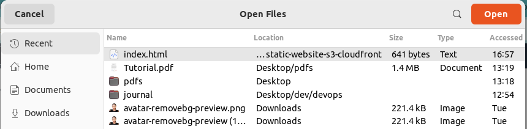

- You should see it here
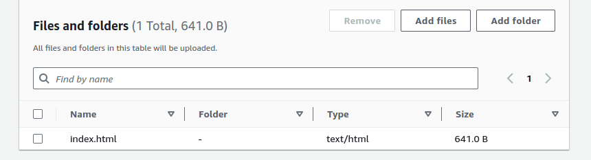

- Click `upload` button at the bottom of the page
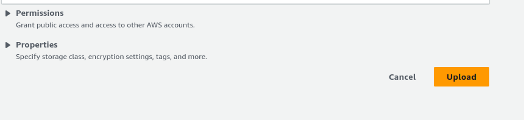

- Success page should appear if successful
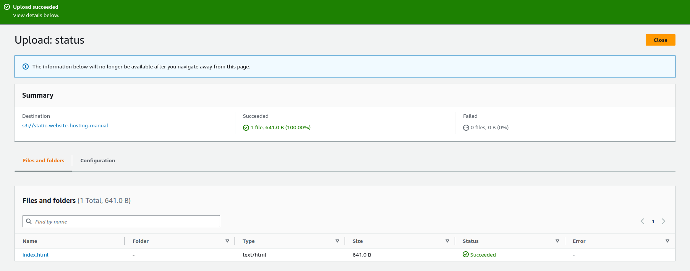


### Step 3
**We will now set up static website hosting** by `enabling static website hosting`

1. Click on the newly created bucket name


You should see a page similar to this
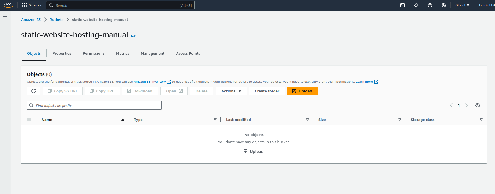

2. Click on properties
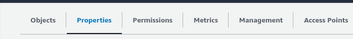

3. Scroll to the bottom of the page, you should see **`static website hosting`** click on the **`edit`** button
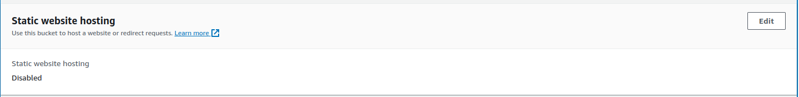

4. Click on **`enable`** on the next page. A form should display. 
- On `Static website hosting` click **enable**
- On `Hosting type` click **Host a static website**
- On `Index document` type **index.html**

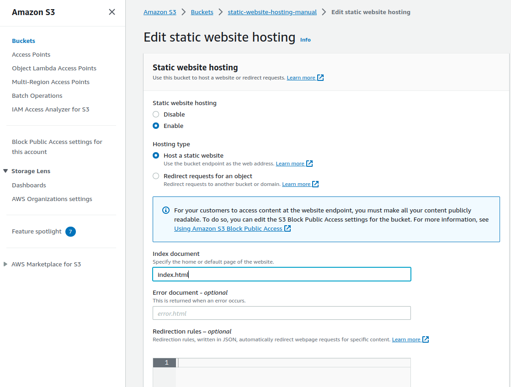

5. Scroll down and click on **Save changes**
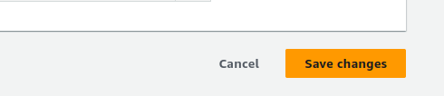


6. A success message should display at the top if successful. Also if we go all the way down to the bottom again it should have produced a link and that is the static website hosting link
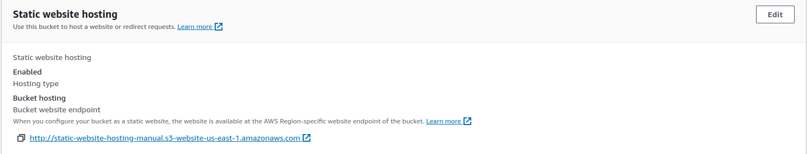 

 Please open it by clicking on it. You may encounter a 403 error. This error occurs because, by default, our bucket is not set to public access. 
 
 If we navigate back to S3, then our bucket, the security feature can be adjusted by going to the 'Permissions' tab at the top.

  
 
 There, we are currently blocking Public Access, making the content not publicly accessible. Even if we enable Public Access, a bucket policy is required to make it accessible over the internet.

 A 403 error signifies 'forbidden,' indicating that you don't have access or permission to access the content, which is perfectly fine. To address this, there are a couple of approaches we can take. One option is to make the content publicly accessible. However, I'd recommend creating a CloudFront distribution to serve our bucket. CloudFront, as a Content Delivery Network (CDN), caches your website's content on multiple servers worldwide. This means that when someone in, for example, India, is downloading your website hosted in England, it will serve the HTML file from a server that's geographically closer. This ensures faster and more efficient content delivery.


 We prefer not to make it public; our intention is to maintain privacy. While it's possible to make content public, we want to ensure that everything is funneled through CloudFront. CloudFront offers additional security features, such as AWS firewall, which is a crucial part of our strategy.

Just to clarify, this is the standard process followed by most professional organizations, particularly for production-level websites. Utilizing a CloudFront distribution or a similar solution is the standard approach for serving web pages efficiently and securely.

 

### Step 4

We need our cloudfront distribution and when we set this up we'll hopefully set up our origin access controls and our bucket policy.


so what we'll do is we'll go back over to AWS and we're going to search for cloudfront, click on it, and create a new distribution Thing we need to do is choose our origin domain, so if we drop this down we have a few options now sometimes they'll say
point it to the S3 bucket and sometimes they'll say point it to the static website hosting URL.
I want to choose the correct bucket so I'm going to just scroll on down and look for it and go and select your origin domain notice right away it says this S3 bucket has static web hosting enabled if you plan to use the distribution as a website we recommend using S3 website endpoint rather than the bucket endpoint and this is very conditional based on your use case, I wish this had a little bit better description in terms of what use case you would use one over the other but I think that we're supposed to actually keep it this way. So it looks like the origin here is it actually is the website bucket domain name so it actually is the domain name so we'll go back here I was totally wrong and up here I'm going to actually use the website endpoint because that's what it wants so make sure you press that button it's using the static website hosting it's not always the case if you're using origin access identities the old one it might want the S3 bucket or it will change the way you do it one three two in order that's probably a good order two is bad it's bad but it's good right anyway so let's scroll on down and we have our HTTP only so we're gonna leave that to Port 80. because that's the protocol it's going to send over to that we'll scroll on down here it says origin path enter the URL path to append to the origin domain name we're going to leave that blank because we don't need to change that it has entered the name of this origin we aren't going to change that we'll keep going down here advanced settings we'll leave those alone HTTP and HTTPS is fine but I probably would want to set to HTTPS only, we'll leave this alone here restrict your access if you restrict access the viewer must use cloudfront sign URLs or cookies to access the content no we're going to leave that alone we have caching policies so cash policy caching optimize we're going to leave that alone am I ever going to change any of these options here we'll leave these alone for now I believe we do set these uh later. I'm gonna go to additional settings these look fine this looks fine just leave this alone that's expensive this is fine we'll go over this twice I realize there's a lot of options
we're not using C names because we're not using custom domain names we do that in the intermediate bootcamp um custom SSL no that'd probably be expensive or we'd use it from um one for our domain so we'll leave that alone okay we actually have something we can enter in default root object index.html

we'll go over this twice here um yeah I think that's that's it so we'll go all the way back to the top okay so yeah all we did is we had that static website hosting here and then we literally scrolled on down down to the ground and we put an index.html in here now there was one thing that I wanted to know is I wanted to know if it was going to use the SS SSL certificate for cloudfront and I think actually in terraform we actually have to tell it explicitly but here we don't I just want to tell you that when you use terraform or when you use cloud formation or any IAC tool just understand that the apis are not always the same as the uis so sometimes the UI does like three four things for you that you don't see but when you do encoding you actually have to know more about how the apis work and that's why I always encourage people learning cloud to start looking at the API sooner so you have a better idea of what that is but I think it's important to look at both the UI and the apis and the clis and the code to understand and try to get a mapping of where things are different if that makes sense I know that's a big mess anyway one other thing I want to do is put a description in because I found out with cloudfront they just really don't help you understand what these things are for, so I'm just going to go here and say Tarahouse example CDN Please fill in a description. Go ahead and create that distribution, and by the way this takes a little bit of time to create and that's the perfect opportunity to go take a break

We gotta just say we don't want WAFF say no to this because this is an extra cost and we'll go ahead and create that distribution so I want folks to go back and click on their distribution and then scroll to the right you can see that note comes in handy here because the rest is really not helpful in terms of information so make sure that you can see your description and then scroll all the right and tell me if the status is enabled. So now the question is will this work if we click into a distribution we get a custom domain name so this is a different domain name from the one that the S3 bucket generated, and the idea is that we're hoping that when we use this domain name it's going to point to S3 bucket and work and it may not work and I have an idea if it doesn't but let's go and see if it works so I'm going to copy it bring it back up to the browser and we still have a 403 the reason we have a 403 is that we probably don't have a bucket policy so coming back to our diagram we're supposed to have an origin access controls and a bucket policy we need those two things in order for it to work and we didn't exactly configure one we didn't see those options when we were doing that but what we'll do is we will go back over to cloudfront

it was called control access settings let's go over here and try origin access and take a look oh look here control settings and identities so it's actually separate from it that's interesting I never knew that so now we know where it is and we'll go ahead and create a control setting So what I want you to do is go over to origin access in cloudfront right and click on this I'll get let's reset the counter we're going to do high with numbers here so we'll need to create a new uh control access I'm going to call this one Tara Town Tara house well hold on it says valid characters letters numbers multiple special characters and say Cara house example arrowhead's example well we don't need the description we'll go down below we say Do not sign requests sign requests we definitely want to sign requests we have an origin type of S3 so that sounds good I'm going to go ahead and create that so I've now created our origin Access Control. 

So how do we actually attach that to our cloudfront distribution in our distribution it looks like when we create our distribution we can do that over here origin access I didn't even notice that when we were doing that so I guess that's an option I wonder if when we created it we could have created it all on the spot I bet we could have eh but wherever that was I I didn't notice it so what we'll do is we'll go back over to our distribution at the top and we'll click into this one and we'll go to behaviors and we'll edit our Behavior because that's where it looked like it was under okay can we change that after the fact I don't think we can
let's go back to that where was that here create distribution in origin configuration in the origin drop down list you can optionally configure origin path to append the origin domain name I don't know if we can change that retroactively you should sign the request the reason you want the request signed is that is what's going to allow it to get access to the the private bucket because they're signed at least that's the way I understand it

I'm going to delete this distribution I know this takes forever but we're going to do it anyway we're going to delete it or sorry 

**disable it first** After disabling it then delete

I'm going to create a new distribution I'm gonna go and choose that uh that S3 address I'm going to ignore that option I'm going to go here instead I'm going to drop down this I'm going to go to here I'm going to scroll on down I'm going to say no to that I'm going to leave all this alone I'm going to set this to index.html and I'm going to say Tara house example two I'm going to create the distribution complete the distribution configuration by allowing read access to cloudfront so that's the last part of it was that even though we created the distribution with the access control policy we still have to have this bucket policy and that is this last part here if we go back to this one where did you go what we need to do is we need to copy it so I'm going to copy that policy and I'm going to go to my S3 bucket permissions right here to edit the bucket policy and paste. I'm going to go back over to cloudfront after it's deployed succesfully it worked. And the most impressive part of this is the fact that the S3 bucket is still
blocking all access that's the cool thing

I'm gonna just start cleaning this up so the way we clean this up you just saw that we we did that before how we deleted that so we'll go ahead and disable this one I think that we can't delete the bucket until well first we got to empty the bucket right the other part of it is that I don't know if it will let us delete the bucket if the the distributions points to it and we'll find that out here in just a moment so go ahead and empty the bucket
okay and I'm going to go and see I can delete the bucket now I'm going to see if it'll let me delete this bucket oh it did oh so I didn't know that so you can delete interesting that's very interesting right unless this one was done because it is disabling maybe it knows it's in a disabled flag but um yeah I would have not thought you'd been able to do that but also it's it's pointing at maybe if it's pointing at the domain name um it doesn't resolve the domain name and so it's not checking the S3 bucket right so what if I know that we set it as S3 bucket but because we're using a cross origin origin access control and when we look in the terraform code it actually uses the domain name


## Automated Setup with Terraform
For the automated setup, we'll leverage Terraform, an infrastructure as code (IaC) tool. Terraform allows us to define our infrastructure in code, making it easy to manage, version, and replicate our static website hosting environment.

[Include Terraform code and instructions for setting up the environment automatically.]

By comparing the manual setup with ClickOps to the automated approach with Terraform, you'll gain a better understanding of the underlying infrastructure and see the benefits of automating repetitive tasks. This knowledge will be valuable as you delve deeper into cloud operations.


