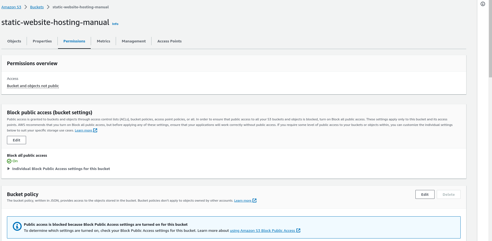

# Creating a Static Website Host: Manual vs. Automated (with Terraform)

Understanding the manual setup of a static website host is an essential first step before automating the entire process, especially if you're new to the cloud space. Just like how you learn basic math before using a calculator, getting hands-on experience by clicking through the cloud resources helps you comprehend how everything is connected. In this blog post, we'll explore the manual setup process (using ClickOps) and the automated approach with Terraform for creating a static website host.

### Architectural Diagram


## Resources
To create a static website host, we'll work with the following AWS resources:

- **S3 (Simple Storage Service):** S3 serves as our storage and content delivery solution.
- **CloudFront Distribution:** We'll use CloudFront to distribute our website content efficiently.
- **Origin Access Controls:** These controls help secure our resources and protect our content.

## Manual Setup (ClickOps)
In the manual setup, we'll navigate through the AWS Management Console to create an S3 bucket, configure static website hosting, and set up a CloudFront distribution. This hands-on approach provides valuable insights into how these components are interconnected.

### Step 1
1. Log in to your AWS Account.  
 
2. Search for S3, then click into S3


S3 is like a super secure digital storage space in the cloud, where you can store and retrieve your files (like documents, pictures, or videos) whenever you need them. It's always available, and you only pay for what you use.

The image below shows some buckets, if your account is new you should not have any buckets listed


3. Go ahead and hit the orange button


4. Enter your bucket name
When naming our buckets in AWS S3, it's important to know they have a global presence. This means that bucket names are like domain names, and the naming rules for domain names also apply to bucket names. Also, each bucket name must be unique worldwide, so you can name it as you wish, as long as it's not already taken.

5. Choose your prefered region, I'm going to choose us-east-1

6. Leave Object Ownership disabled


7. Scroll on down, Keep that checkmark that says **`Block all public access`**

8. Keep bucket versioning **`Disabled`**


9. Scroll down, For **Encryption Type** Leave it on **`Server-side encryption with Amazon S3 managed keys (SSE-S3)`**

10. Keep `bucket key` **enabled**


11. In Advanced settings Keep **`Object lock`** **`Disabled`**


12. Go ahead and create the bucket by clicking on the `create bucket` orange button


13. If the bucket is created successfully the green message should appear


14. Check if the bucket is listed


### Step 2
We need to upload some html code to our S3 bucket.

1. Copy the code below or use your own html code
```html
<!DOCTYPE html>
<html>
<head>
    <title>Pizza Preparation List</title>
    <style>
        body {
            font-family: Arial, sans-serif;
        }
        h1 {
            text-align: center;
        }
        ul {
            list-style-type: disc;
            margin-left: 20px;
        }
        li {
            font-size: 18px;
        }
    </style>
</head>
<body>
    <h1>Pizza Preparation List</h1>
    <ul>
        <li>Prepare pizza dough</li>
        <li>Add tomato sauce and cheese</li>
        <li>Add your favorite toppings</li>
        <li>Bake in the oven</li>
        <li>Slice and serve</li>
    </ul>
</body>
</html>

```
Save it in your system, You can open notepad or IDE and paste the html code, save it as index.html

2. Go back to S3, click open the bucket name


3. Click on the orange upload button


You should see a page similar to this


4. Click on `Add files`


- Select your index.html file from where you saved it


- You should see it here


- Click `upload` button at the bottom of the page


- Success page should appear if successful


### Step 3
**We will now set up static website hosting** by `enabling static website hosting`

1. Click on the newly created bucket name


You should see a page similar to this


2. Click on properties


3. Scroll to the bottom of the page, you should see **`static website hosting`** click on the **`edit`** button


4. Click on **`enable`** on the next page. A form should display. 
- On `Static website hosting` click **enable**
- On `Hosting type` click **Host a static website**
- On `Index document` type **index.html**


5. Scroll down and click on **Save changes**


6. A success message should display at the top if successful. Also if we go all the way down to the bottom again it should have produced a link and that is the static website hosting link
 

 Please open it by clicking on it. You may encounter a 403 error. This error occurs because, by default, our bucket is not set to public access. 
 
 If we navigate back to S3, then our bucket, the security feature can be adjusted by going to the 'Permissions' tab at the top.

  
 
 There, we are currently blocking Public Access, making the content not publicly accessible. Even if we enable Public Access, a bucket policy is required to make it accessible over the internet.

 A 403 error signifies 'forbidden,' indicating that you don't have access or permission to access the content, which is perfectly fine. To address this, there are a couple of approaches we can take. One option is to make the content publicly accessible. However, I'd recommend creating a CloudFront distribution to serve our bucket. CloudFront, as a Content Delivery Network (CDN), caches your website's content on multiple servers worldwide. This means that when someone in, for example, India, is downloading your website hosted in England, it will serve the HTML file from a server that's geographically closer. This ensures faster and more efficient content delivery.


 We prefer not to make it public; our intention is to maintain privacy. While it's possible to make content public, we want to ensure that everything is funneled through CloudFront. CloudFront offers additional security features, such as AWS firewall, which is a crucial part of our strategy.

Just to clarify, this is the standard process followed by most professional organizations, particularly for production-level websites. Utilizing a CloudFront distribution or a similar solution is the standard approach for serving web pages efficiently and securely.

 

### Step 4

We need our cloudfront distribution and when we set this up we'll hopefully set up our origin access controls and our bucket policy.


1. In the AWS console search for cloudfront, click on it.

 
  
2. Click on `Create a CloudFront distribution button`
 

3. Fill the form
- On `Origin name` Select the bucket name you created
**Ignore the box asking to `Use website endpoint`**
- On `Name` Enter any name of your choice
- On `Origin access` Select **Origin access control settings (recommended)**

 

4. Since you select the **Origin access control settings (recommended)** we will have to `create control setting` Click `Create control setting`
 

Fill the form like the image below
- On `Name` enter a unique name
- On `Description` enter any description of your choice though it's optional
- On `signing behavior` select `Sign requests (recommended)`
- On `Origin type` select `S3`

Then click `create`
 


5. On `Enable Origin Shield` select `No`
 

6. Leave these options as default
 


7. Select `Do not enable security protections`


8. On `Default root object - optional` enter **index.html** and on `Description - optional` enter any description of your choice. Leave the rest as defualt then click on **create distribution** button


**It takes a bit of time to create**

9. If successful, a banner displaying `Successfully created new distribution` should appear


10. Click on `Copy policy`


11. Go to S3 and click on your bucket name or just click on this link here


12. Scroll down to `Bucket Policy` and click on `edit` button here


13. Paste the bucket policy you copied


14. Click on `save changes`


If successful, a `Successfully edited bucket policy` banner should display

15. Go back to cloudfront distribution and click on your distribution name, we get a custom domain name so this is a different domain name from the one that the S3 bucket generated,


16. Click the icon before the `distribution domain name` to copy the url and paste it in a browser and that's it, your site should appear


### Step 5 Clean up
#### Deleting the CloudFront Distribution:

1. Navigate to the CloudFront service.

2. Tick the box left to the distribution ID or name, then click **disable**


4. After disabling, click `delete`.

#### Deleting the S3 Bucket:
1. Go to the Amazon S3 service in the AWS Management Console.

2. Choose the S3 bucket associated with the CloudFront distribution you just disabled.

3. Before deleting the bucket, ensure it's empty. Delete all objects (files) inside the bucket. You can select each object and choose "Delete" or use a bulk delete method.

4. Check and remove any bucket policies, access control lists (ACLs), or versioning that might prevent bucket deletion.

5. Once the bucket is empty and there are no restrictions, select the bucket, and then from the "Actions" dropdown, choose "Delete bucket".

### Important Note:
- Deleting a bucket or distribution is irreversible and will permanently remove all stored objects or cached files. Ensure you have backups or copies of any data you might need before deletion.
- The deletion process might take some time, especially for CloudFront distributions, due to the global caching network.


## Automated Setup with Terraform
For the automated setup, we'll leverage Terraform, an infrastructure as code (IaC) tool. Terraform allows us to define our infrastructure in code, making it easy to manage, version, and replicate our static website hosting environment.

By comparing the manual setup with ClickOps to the automated approach with Terraform, you'll gain a better understanding of the underlying infrastructure and see the benefits of automating repetitive tasks. This knowledge will be valuable as you delve deeper into cloud operations.


